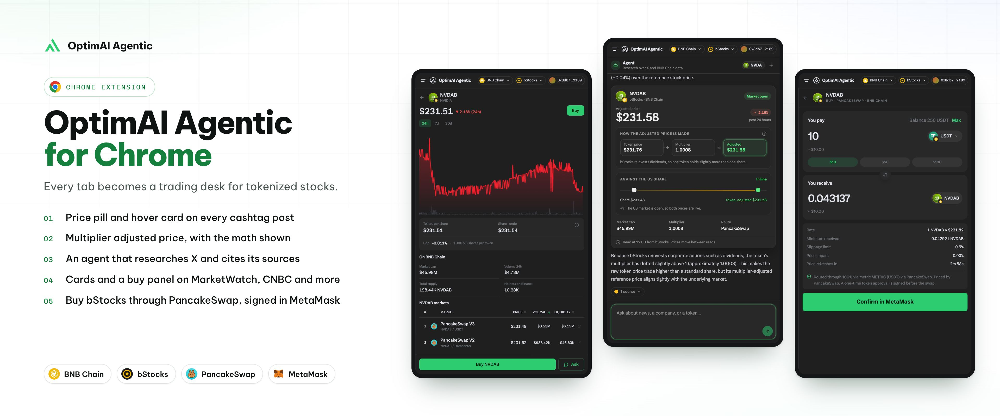
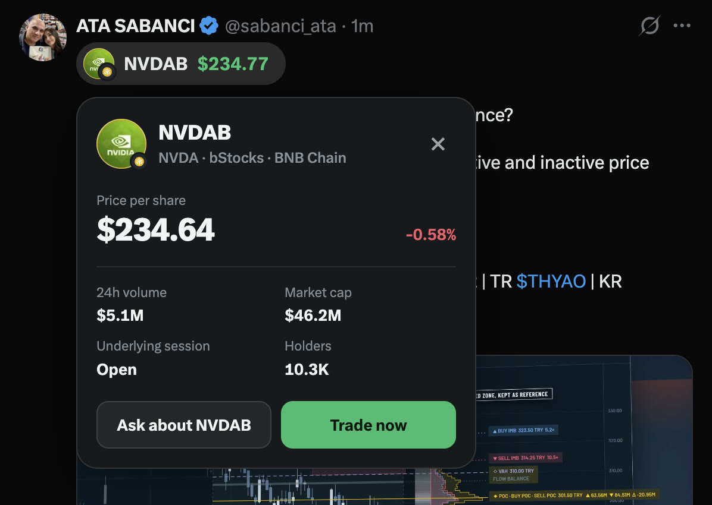
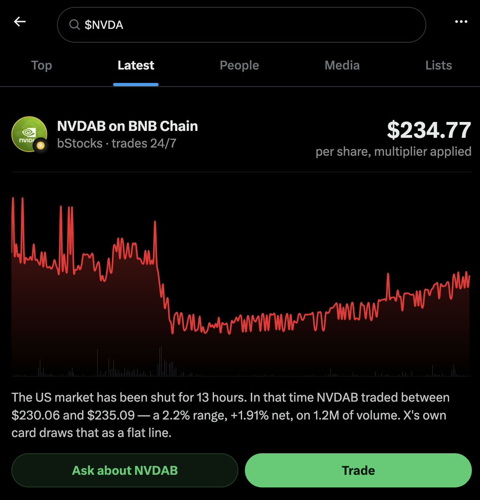
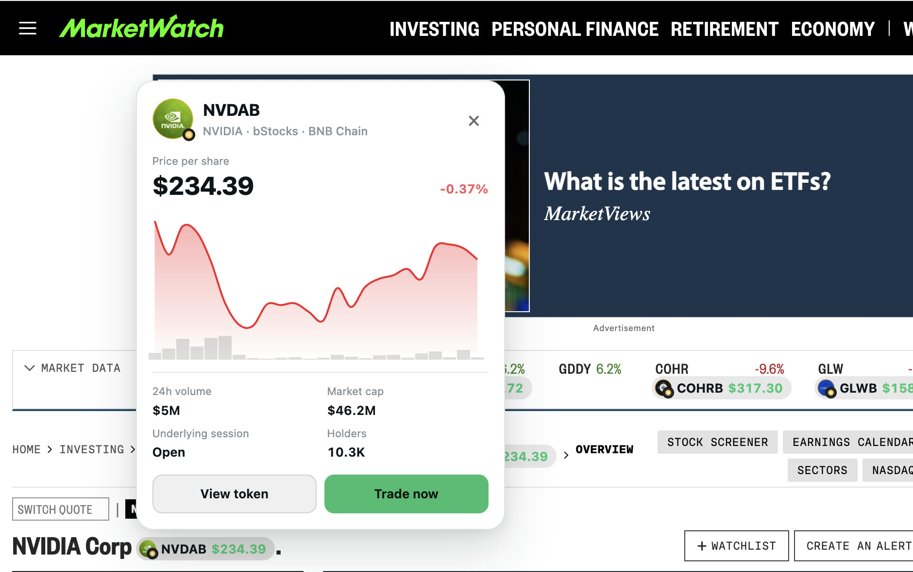
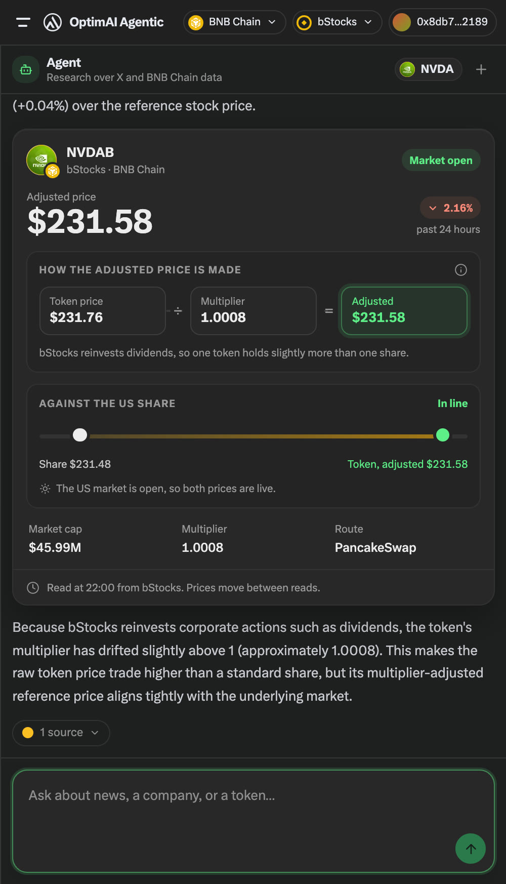
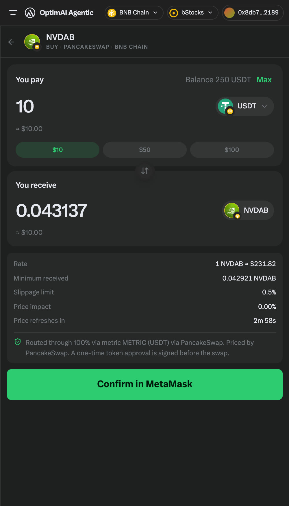

# OptimAI Agentic for Chrome

<p align="center">
  
</p>

A Chrome extension that corrects what X tells you about tokenized stocks, and
lets you act on the correction without leaving the page. Built for **BNB Hack:
Tokenized Stocks Edition** on **BNB Chain with bStocks**. Spot trades only.

**[Download v1.0.0](https://github.com/OptimaiNetwork/optimai-agentic-extension/releases/download/v1.0.0/OptimAI-Agentic-Chrome-Extension-1.0.0.zip)** |
**[Android app](https://github.com/OptimaiNetwork/optimai-agentic-android)**

## Quick start

1. Download `OptimAI-Agentic-Chrome-Extension-1.0.0.zip` from the link above and unzip it.
2. Open `chrome://extensions`, turn on Developer mode, click **Load unpacked** and select the unzipped folder.
3. Open [x.com](https://x.com) and click **OptimAI Agentic** in the left sidebar. The panel opens.
4. In the panel header set the chain to **BNB Chain** and the issuer to **bStocks**. The choice is remembered.
5. Search `$NVDA` on X. To buy, install MetaMask in the same Chrome profile and select BNB Smart Chain.

To build it yourself, see [Build and test](#build-and-test).

## Features

### Price on every post

A cashtag that names a listed ticker gets a button in the action bar. It opens
the panel on that ticker, with the price on the selected chain (the multiplier
already divided out), what the underlying share costs, and whether the token can
actually be bought.

<p align="center">
  
</p>

### A card on the cashtag search page

Search `$NVDA` on X and you get NVIDIA Corp, NASDAQ, $222.27. Nothing on the page
says a tokenized NVDA trades on BNB Smart Chain, or that it kept trading after
that price froze.

A card goes in above X's own, carrying a chart with the hours the exchange was
shut shaded in, and what the token did across them. Measured on one such
closure: from Friday's closing bell, NVDAB traded for 14 hours through a **2.17%
range on 1.68 million of volume**. X's card draws that as a flat line.

<p align="center">
  
</p>

### Stocks on other sites

A lighter content script finds tokenized stocks mentioned on ordinary pages,
puts a card behind each one and opens the same trade panel. It stays off X,
mail, document editors, sign-in pages and the trading venues themselves.

<p align="center">
  
</p>

### Ask the agent

The panel has a chat with an agent. To research a ticker it can ask the
extension to open X's own search for a query (Latest or Top) in the current tab
and scroll it like a reader would, up to 28 scroll steps or 40 seconds per
search. The extension never calls X's API itself: it reads the responses the
page loads anyway (see [How it works](#how-it-works)) and hands the parsed posts
to the agent, which classifies them and writes the answer. Follow-up questions
are answered from the same posts and the live numbers.

<p align="center">
  
</p>

### Buy in your wallet

At the end: a live quote, an unsigned transaction, and your own wallet
(MetaMask). Nothing here is a recommendation to buy or sell; the panel reports
evidence and numbers and the decision stays yours.

<p align="center">
  
</p>

## How it works

### Reading X

Search `$TSLAx` and X shows contract `XsDoVf…HzoB`, a **Solana** mint. The BSC
token is `0x8ad3c73f…`, a different address entirely. Parse the contract off X's
card and you have the wrong chain.

This is structural, not a bug X will fix. Its cashtag stack is Solana-native:
feature flag `rweb_cashtags_enabled`, chart data from Birdeye, RPC from Helius,
actions from Dialect, and `contract_address` filled from a generic `asset.crypto`
field.

**A browser extension can correct the page. The page cannot correct itself.**

The extension reads X's own network traffic rather than asking X for anything: a
MAIN-world content script at `document_start` hooks `XMLHttpRequest` before X's
bundle can take its own reference, and parses the responses the page was already
loading. When the agent searches, it drives X's own UI to make the page load
them. No request is made to X that the page would not have made.

### Three things that are easy to get wrong

**One token is not one share.** Ondo and bStocks tokens reinvest dividends, so
the multiplier drifts above 1. Measured live: `AGGon` has a multiplier of
1.038181, and comparing its raw token price to the share price shows a **+3.818%
gap**. Divide first and it is **−0.000%**. The gap is arithmetic. It affects 255
of the 667 tokenized stocks on BSC.

**Only one issuer has a market on BSC.** Probing PancakeSwap V2, V3 and the
Infinity vault: NVDAB carries **$1.42M** of depth, TSLAB $482K, SPYB $351K, while
AAPLx, TSLAx and NVDAx all measure **$0 to $10**. xStocks is deployed on BSC at
scale and cannot be bought there. Ondo has a price and almost no pool, because it
settles by RFQ off the AMM entirely.

**bStocks publishes no share price.** Verified null for AAPLB, MSFTB, GMEB and
DJTB. The comparison price is borrowed from the Ondo token of the same ticker,
and the panel names the source. Ten of the 77 bStocks have no counterpart
anywhere, and those simply show no gap rather than one computed against zero.

### Storage and keys

| What | Where | Lifetime |
| --- | --- | --- |
| Chat transcript (up to 30 messages, about 2 MB, one per tab) | `chrome.storage.session` | until the browser closes |
| Chain and issuer choice | `chrome.storage.local` | until the extension is removed |
| Trades waiting to be recorded in the portfolio | `chrome.storage.local` | until recorded |

Nothing is kept in the page's own `localStorage`, which x.com's scripts can read.
There is no account and no sign-in. The extension holds no API keys, and the
wallet holds the only private key.

<details>
<summary>Chains and issuers in this build</summary>

The panel opens on **Solana with Ondo** tokens (`DEFAULT_CHAIN` and
`DEFAULT_VENUE` in `packages/shared/lib/constants/env.ts`). A switcher in the
panel changes the pair. The listings are:

| Chain | Issuers |
| --- | --- |
| Solana (default) | Ondo, PreStocks |
| BNB Chain | bStocks, Ondo |

Switching to BNB Chain with bStocks is the path the hackathon findings above
were measured on. On the Solana side MetaMask signs too.

</details>

## Build and test

You need Node 22.15.1 or newer (`.nvmrc`) and pnpm 10.11 (`packageManager` in
`package.json`; `corepack enable` picks it up).

```bash
pnpm install                     # also copies .example.env to .env if there is no .env
pnpm build                       # then load dist/ at chrome://extensions (Developer mode)
pnpm dev                         # watch build, for development
```

After every rebuild, press reload on the extension card at `chrome://extensions`
and reload the x.com tab.

```bash
pnpm -F @extension/content-ui test   # 411 unit tests in 37 files, no browser
pnpm -F chrome-extension test        # 2 unit tests for the background fetcher
pnpm type-check
pnpm lint
```

The end to end suite is different in kind. It drives a real, signed-in Chrome
on the **real x.com**, with no retries, and it
makes one live model call. It is 24 tests in 8 spec files. Read
`tests/e2e/README.md` before running it, because it touches a real X account.

```bash
pnpm build && pnpm -F @extension/e2e e2e
```

## Project layout

```
pages/content/src/matches/x-network/    MAIN world, document_start: hooks XHR
pages/content/src/matches/svm-wallet/   MAIN world: the Solana wallet bridge
pages/content-ui/src/matches/x/         the panel, the tweet button, the search card
pages/content-ui/src/matches/web/       the card on every other site
chrome-extension/src/wallet/            MetaMask, from the background
chrome-extension/src/api/               the background fetcher for API calls
packages/shared/                        constants, message types, the agent card contract
```

## License and credits

MIT, see [LICENSE](LICENSE). Extension scaffolding from
[chrome-extension-boilerplate-react-vite](https://github.com/Jonghakseo/chrome-extension-boilerplate-react-vite)
(MIT). See [THIRD_PARTY_NOTICES.md](THIRD_PARTY_NOTICES.md), which also covers the
Ajv code embedded in the generated validators.
